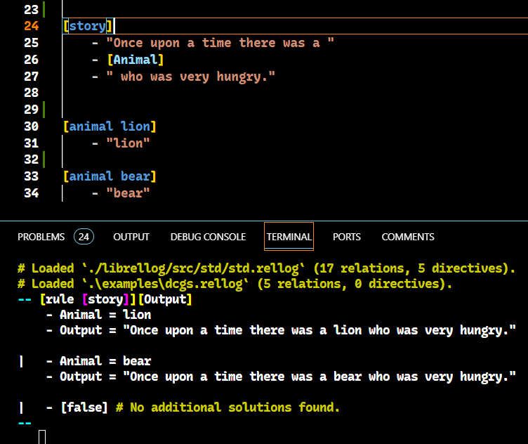

# Rellog

It means "Relational Prolog".

## Idea

Instead of predicates, this implementation focuses on relations. While a Prolog predicate can be thought of a symbol and an ordered tuple of arguments, a relation is an unordered collection name-value pairs (called attributes).

While in Prolog you might write

```prolog
append([1, 2], [3, 4], Compound)
```

in Rellog you could write any of the following:

```clojure
[prefix {1, 2}][suffix {3, 4}][compound Compound]
[prefix {1, 2}][suffix {3, 4}][Compound]
[suffix {3, 4}][prefix {1, 2}][Compound]
[suffix {3, 4}][Compound][prefix {1, 2}]
[prefix {1, 2}][Compound][suffix {3, 4}]
[Compound][suffix {3, 4}][prefix {1, 2}]
[Compound][prefix {1, 2}][suffix {3, 4}]
```

## Example

```clojure
[prefix {}][Suffix][compound Suffix]
[prefix {A ..As}][Suffix][compound {A ..Compound}]
    - [prefix As][suffix Suffix][Compound]

[forward {}][backward {}]
[forward {A ..As}][Backward]
    - [forward As][backward AsBackward]
    - [prefix AsBackward][suffix {A}][compound Backward]
```

Note that conjunctions are expressed as indented `-`-preceded lists.

## Goals

* Focus on relations between values rather than names of relations.
* Be easy to type. Avoid unusual symbols (like backtick, ampersand, caret, fore/backslash, tilde).
* Have clean, simple syntax for grammars (DCGs).
* Have efficient string types that still feel like lists.
* Prioritize automatic choicepoint elimination rather than efficiency. This makes irrelevant many common uses of "cut."
* Avoid the trailing period problem that prolog suffers from.



## Installation

First download and build Rellog. You'll need a relatively recent (as of October 2023) Rust compiler. If you have Rust installed, you'll need to make sure you're using the nightly compiler.

```shell
$ git clone https://github.com/eignnx/rellog.git
$ cd rellog
$ rustup override set nightly
$ cargo build
```

It may take a few minutes to build, but afterwards you can open a REPL session:

```shell
$ cargo run
```

## Language Reference

### Table of Contents
- [Overview: The Big Ideas](#overview-the-big-ideas)
- [Getting Help](#getting-help)
- [Clauses](#clauses)
- [Rellog Values](#rellog-values)
    - [Symbols](#symbols)
    - [Integers](#integers)
    - [Text Strings](#text-strings)
    - [Variables](#variables)
    - [Relations](#relations)
    - [Lists](#lists)
    - [Blocks](#blocks)
- [The REPL](#the-repl)


### Overview: The Big Ideas

Rellog is all about ***relations***. A relation is a set of associations of values (kinda like a set of dictionaries each of which have the same schema).

An example of a relation might be a student-teacher relationship. In Rellog, the sentence "Gideon and Aditya are students of Dr. Blum" could be expressed as two facts about the world:

```clojure
[[comment "Fact #1:"]]
[student gideon][teacher dr_blum]

[[comment "# Fact #2:"]]
[student aditya][teacher dr_blum]
```

We refer to this relation by its ***signature*** which is written:

```yaml
[student][teacher]
```

A signature is a set of symbols which are the names of the relation's ***keys***.

If you're familiar with Excel, think of a relation as a ***spreadsheet***. A relation's signature then is just the spreadsheet's ***column names***.

Here's a bigger example involving multiple relations.

```clojure
[course cmpsc385][instructor dr_null]
[course cmpsc375][instructor dr_blum]
[course cmpsc439][instructor dr_na]

[course cmpsc385][name "Operating Systems"]
[course cmpsc375][name "App Development"]
[course cmpsc439][name "Compilers"]

[student gideon][course cmpsc361]
[student gideon][course cmpsc439]
[student aditya][course cmpsc375]
[student aditya][course cmpsc439]
```

This is a set of facts about three different relations:
1. The `[course][instructor]` relation,
1. the `[course][name]` relation, and
1. the `[student][course]` relation.

An interesting question to ask might be "who are all the students of Dr. Na?"

We can pose this question as a Rellog query in the REPL:

```clojure
-- [instructor dr_na][Course];
   [Course][Student]

    - Course = cmpsc439
    - Student = gideon
|
    - Course = cmpsc439
    - Student = aditya
```

We could even define the `[student][teacher]` relation in Rellog by writing a fact with a collection of conditions:

```clojure
[Student][Teacher]
    - [instructor Teacher][Course]
    - [Course][Student]
```

This rule says:

> A student called `Student` has a teacher called `Teacher` if:
> 1. `Teacher` is the instructor of a course called `Course`, and
> 2. `Student` is a student in that same course `Course`.

Now, to ask who Gideon's teachers are we could query:

```yaml
-- [student gideon][Teacher]

    - Teacher = dr_null
|
    - Teacher = dr_na
```

### Getting Help

There are many relations predefined for you to use in your Rellog code. Use the `[sig][help]` relation to query them:

```yaml
-- [Sig][Help]

    - Sig = [prefix][suffix][compound]
    - Help =
       """
       Relates a list `Compound` to some partitioning 
       of itself into a `Prefix` and a `Suffix`. Also 
       works for text strings.
       """
```

The `[sig][help]` relation is good to use to document your own relations too.

There's also the `[help]` relation. It performs a side-effect when queried (so it's not a pure relation). It prints out the `Help` text associated with the signature passed in:

```
-- [help [pred][succ]]

Relation: [pred][succ]<br/>
--------------
Relates two adjacent integers: a predecessor and a successor.
```


It's just a little easier on the eyes.

### Clauses

A clause is a top-level definition. A clause is either:

1. A **fact**:

    The following three facts declare that three symbols (`socrates`, `chomsky`, and `you`) refer to humans.
    ```yaml
    [human socrates]
    [human chomsky]
    [human you]
    ```
    Here's another example of a fact:
    ```yaml
    [nonempty_list {A ..B}]
    ```
1. A **rule**:

    A rule has conditions. Heres an example of a rule:
    ```yaml
    [mortal X]
        - [human X]
    ```
    This rule says "an `X` is `mortal` if that `X` is `human`.

    Lets query the `mortal` rule.
    ```yaml
    -- [mortal socrates]
        - [true] # Exactly 1 solution found.
    
    -- [mortal Who]
        - Who = socrates
    
    |   - Who = chomsky
    
    |   - Who = you # Exactly 1 solution found.
    
    -- [mortal somebody_new]
        - [false] # The query has no solutions.
    ```

### Rellog Values

Rellog has the following kinds of values:

#### Symbols
- Identifiers for concepts.
- Have no meaning on their own. 
- Implemented as interned strings.

##### Examples

```yaml
socrates

my_dog

area_51

multiply

'NotAVariable'
```

#### Integers
Arbitrarily-sized integers (positive or negative whole numbers)

##### Examples
`0`, `17`, `-3`, `93740925370000349251`

#### Text Strings

- Represent textual data.
- Useful when text must be constructed or parsed.
- **Warning: Text is still a work in progress.**
##### Examples
```python
"Hello?"

"Text strings may contain spaces and punctuation."

# The remainder of this example is 1 text string literal:
"""
They can also be multi-line.

Like this!

Single linebreaks at the end of a 
line will combine the two lines into
a single paragraph.

Double linebreaks create a new paragraph.
"""
```

#### Variables
- Must start with a capital letter or an underscore (`_`).
- Very similar to variables in *algebra*.
- Less similar to the variables in *imperative programming languages*.
- May be *known* (bound to a specific value) or *unknown* (not yet bound to a value).

##### Examples

`X`, `ListReversed`, `State0`, `_123`

#### Relations

- Sets of ***key-value pairs***. We call a key-value pair an ***attribute***.
- The set of keys defines the name of a relation e.i. the set `{k1, k2, k3}` corresponds to a relation whose ***signature*** is `[k1][k2][k3]`.
- The following 2 relations are the same because order does not matter.
    - `[list][member]`
    - `[member][list]`
- ***Note:*** you cannot put any whitespace between the `]` and the `[` within relation value, i.e. this is two separate relations, not one:
  
    ```yaml
    [list]   [member]
    ```
##### Examples
```yaml
[list L][member M]

# The following 2 are the same:
[human Human]
[Human]


[numerator 4][denominator 3][Quotient][Remainder]

# The following 2 are the same:
[prefix][suffix][compound]
[prefix prefix][suffix suffix][compound compound]

# Relations of symbols that match the keys are referred to as *relation signatures*.

# Use the `[sig][help]` relation to get documentation on a relation.
[sig [list][member]][Help]
```

##### Uses
Relation literals can be used where `struct`s, `record`s, or `class`es are used in other languages. For example, if a datatype is represented in C like this:
```c
typedef struct Person {
    char* name;
    uint8_t age;
    long bank_balance_cents;
} Person;

(Person) { .name = "casey", .age = 29, .bank_balance_cents = -4400 }
```

Or in Python like this:

```python
from dataclasses import dataclass

@dataclass
class Person:
    name: str
    age: int
    bank_balance_cents: int
    
Person(name='casey', age=29, bank_balance_cents=-4400)
```

In Rellog, this kind of person is representable by values with signature `[name][age][bank_balance_cents]`.

An example value of this type would be:
```yaml
[name casey][age 29][bank_balance_cents -4400]
```

#### Lists

Lists are defined inductively by this relation:
```yaml
[list {}]

[list {Element ..Tail}]
    - [list Tail]
```

In words, a list is either:
1. The empty list written: `{}`
2. A pair `{A ..B}` where `A` is an element of the list, and `B` is the ***tail*** of the list.

A list's ***tail*** is itself a list. So a tail is either a pair `{C ..D}` or the empty list `{}`.

The following is an abbreviation used to write out lists:
```yaml
{1 2 3}
# The above is the same as the following:
{1 ..{2 ..{3 ..{}}}}
```


##### Examples
```yaml
{} # The empty list.

{0 1 -1 2 -2} # A list with five integers.

{a b c ..Rest} # A partial list.

{1 ..{2 ..{3 ..{}}}} # Same as `{1 2 3}`.

{{}} # A list containing 1 element: the empty list.

{{1 2 3} {4 5 6} {7 8 9}} # A list of lists.

# A heterogenous list (rarely useful).
{{a b c} -31415 [x 3][y -1]}
```

#### Blocks

- Represent sequences of code.
- Use `-` for conjunction ("and"), and `|` for disjunction ("or").
- Semicolon (`;`) can be used for single-line conjunction blocks (useful in the REPL).

##### Examples

```yaml
- [first_condition "asdf"]
- [second][condition {1 2 3}]

# Another way to write conjunction ("and"):
[first_condition "asdf"]; [second][condition {1 2 3}]

| [either][This]
| [or][that 49]
| [or][even][this]
```

### The REPL

The REPL (Read-Eval-Print Loop) is the interactive environment where Rellog code can be loaded and run.

#### REPL Commands

There are several commands that directly interact with the REPL. Most of them begin with a colon (`:`).

| REPL Command            | Description |
| -------------------------- | ----------- |
| `:h`, `:help`, `help`, `?` | Show the help menu. |
| `:r`, `:reload` | Reload the currently loaded source files. |
| `:l <PATH>`, `:load <PATH>` | Load a source file located at `<path>`. Use in conjunction with `[cd]` to change the current working directory, and `[cwd]` to see the current working directory. |
| `:u <PATH>`, `:unload <PATH>` | Sometimes you want to stop paying attention to a file (maybe it was deleted and is no longer relevant). You can tell the REPL to forget about the file with `:unload`. |
| `:q`, `:quit`, `:e`, `:exit`, `:wq` | Quit the REPL. Can also be done with `CTRL-C` or `CTRL-D`. |
